# CITY BOT

*Телеграм-бот для игры в города*

## Правила игры

* Бот называет город
* Вы называете город, начинающийся на последнюю букву города бота
* *Если вы ошиблись буквой, игра заканчивается*

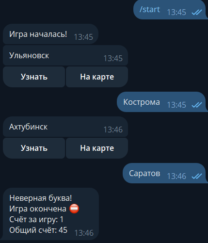

*Исключения: буквы Ы и Ь*

*За последнюю букву в таком случае случае принимается предпоследняя*

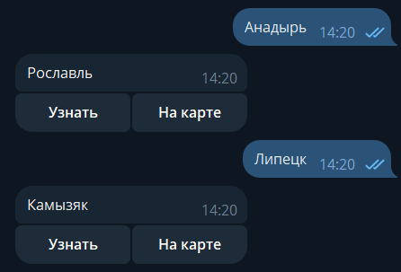

* Города не должны повторяться

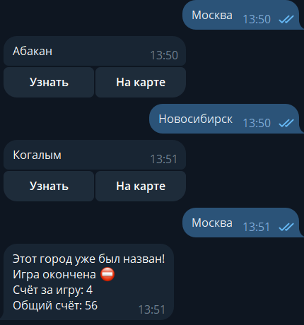

* Используются только существующие города России

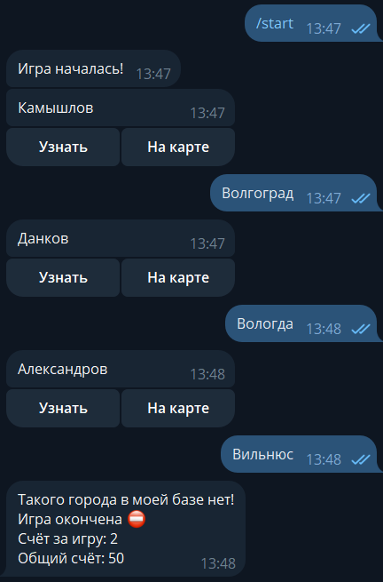

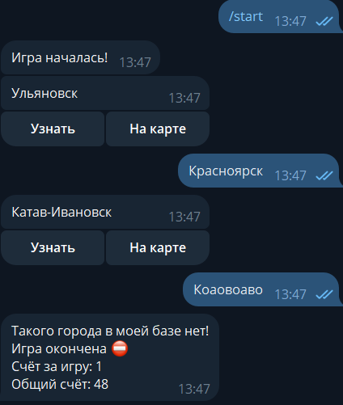

## Команды

* /help - список команд

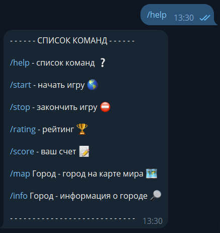

* /start - начать игру

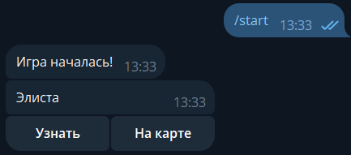

* Узнать - общая информация о названном городе

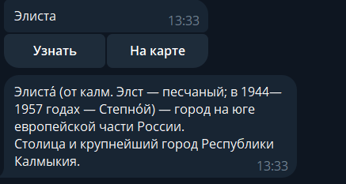

* На карте - обозначение названного города на карте

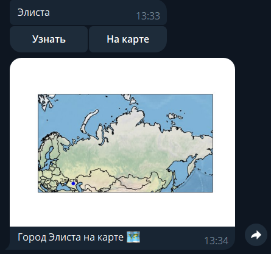

* /stop - закончить игру

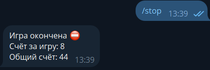

* /rating - топ-5 игроков за всю игру

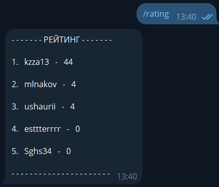

* /score - статистика игрока

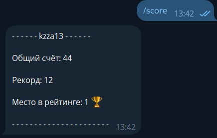

* /map Город - обозначение города на карте
* /info Город - общая информация о городе

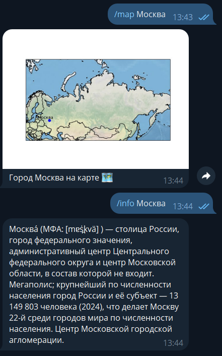